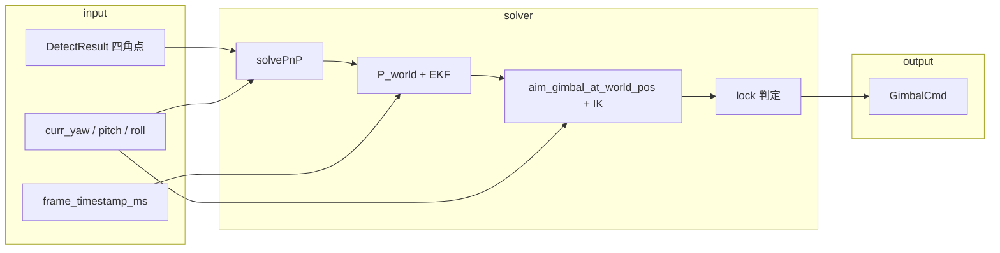

# Solver 解算模块

对应源码：[`src/solver.cpp`](../src/solver.cpp)、[`include/solver.h`](../include/solver.h)。

`Solver` 将检测角点 → 世界系目标位置 → EKF 平滑与提前量 → 云台 yaw/pitch（2 轴 IK），并输出锁定状态与可视化用的 PnP 量。

---

## 1. 职责与调用关系



主循环（`main.cpp`）在图像时间戳对齐的姿态 `matched_yaw/pitch/roll` 上调用 `solve()`，将 `cmd.target_yaw/pitch` 经串口下发云台。

| 接口 | 说明 |
|------|------|
| `Solver()` | 从 `config.yaml` 加载相机、靶标尺寸、偏移、EKF/IK 参数 |
| `solve(...)` | 单帧主入口，返回 `GimbalCmd` |
| `reset_filter()` | 目标丢失时清空位置 EKF |
| `aim_gimbal_at_world_pos`（private） | 给定世界系目标点，解算瞄准 yaw/pitch |

---

## 2. 坐标系与符号约定

### 2.1 世界系（云台系）

- **原点**：云台旋转中心。
- **轴**：与 Eigen 机体一致，**+X 前、+Y 左、+Z 上**（右手系）。
- 下位机反馈的 `curr_yaw/pitch/roll`（度）用于构造当前姿态。

### 2.2 云台姿态矩阵

\[
R_{\text{gimbal}} = R_z(\text{yaw}) \cdot R_y(\text{pitch}) \cdot R_x(\text{roll})
\]

实现：`R_gimbal_from_deg()` / `solve()` 内 `yaw_rot * pitch_rot * roll_rot`。

- **可控**：yaw（Z）、pitch（Y）。
- **不可控**：roll（X）仅来自测量，IK 中固定为 `curr_roll`。

> **Pitch 极性**：`solve()` 内对 `curr_pitch` 使用 `+pitch`（无负号），与下位机反馈约定一致；若云台方向反了需在此核对。

### 2.3 OpenCV 相机系 → 云台 Eigen 系

`solvePnP` 得到 `tvec = (tx, ty, tz)` 后映射为：

```cpp
P_cam = (tz, -tx, -ty)
```

### 2.4 结构偏移（`config.yaml` → `offset`）

| 配置项 | 成员 | 单位 | 作用 |
|--------|------|------|------|
| `cam_to_gimbal` | `cam_offset` | m | 相机光心相对转心 |
| `ray_to_gimbal` | `ray_offset` | m | 激光口相对转心 |
| `rpy_cam_to_ray` | `R_cam_to_ray` | deg `[roll,pitch,yaw]` | 相机系 → 激光系旋转 |

目标世界坐标：

\[
P_{\text{world}} = R_{\text{gimbal}} \,(P_{\text{cam}} + \text{cam\_offset})
\]

激光口世界坐标：

\[
O = R_{\text{gimbal}} \,\text{ray\_offset}
\]

激光发射轴在机体系（激光系 +X）：

```cpp
laser_axis_body = (R_cam_to_ray.transpose() * UnitX).normalized()
laser_axis_world = R_gimbal * laser_axis_body
```

---

## 3. `solve()` 流水线

### 3.1 PnP 与有效性

1. 要求 `target.corners.size() == 4`。
2. `solvePnP(object_3d_points, ...)`，`object_3d_points` 由 `target.width/height` 在 **y-z 平面** 上构造矩形（x=0）。
3. `tz <= 0` 时直接返回空命令。

### 3.2 位置 EKF（匀速 6 维）

状态 \(\mathbf{x} = [x,y,z,v_x,v_y,v_z]^T\)。

| 阶段 | 说明 |
|------|------|
| 预测 | \(F\) 为匀速模型；`dt` 由相邻帧时间戳差（1–500 ms）或 `default_dt_s` |
| 量测 | \(H\) 只观测位置；\(z = P_{\text{world}}\) |
| 输出平滑位置 | `P_smooth` → `cmd.p_world_*` |
| 提前量 | \(P_{\text{pred}} = P_{\text{smooth}} + \mathbf{v}\,T_{\text{horizon}}\)，\(T_{\text{horizon}}=\) `predict_horizon_s` |

`update_position_ekf()` 在首次有效量测时初始化 EKF；`reset_filter()` 在目标丢失时调用。

### 3.3 瞄准角：初值 + IK

对 \(P_{\text{pred}}\) 调用 `aim_gimbal_at_world_pos()` → `cmd.target_yaw/pitch`。

### 3.4 锁定判定 `is_locked`

同时满足：

1. `|normalize(target_yaw - curr_yaw)| < lock_range`
2. `|target_pitch - curr_pitch| < lock_range`
3. 若 `lock_beam_deg >= 0`：当前姿态下 `laser_axis_world` 与「口→预测目标」单位向量夹角 \(<\) `lock_beam_deg`（用点积与 \(\cos\theta\) 比较）

> `lock_beam` 用的是**当前** \(R_{\text{gimbal}}\) 与**预测点**弦向，不是 IK 最优姿态下的光束误差。

---

## 4. 瞄准：`aim_gimbal_at_world_pos`

### 4.1 初值（弦向种子）— 不含 `rpy_cam_to_ray`

```cpp
aim_vec = P_world - R_now * ray_offset   // 当前姿态下激光口 → 目标
out_yaw   = atan2(aim_vec.y, aim_vec.x)
out_pitch = -atan2(aim_vec.z, dist_horiz)
```

| 项目 | 是否参与 |
|------|----------|
| `cam_offset` | 间接（已并入 `P_world`） |
| `ray_offset` | 直接（口位置） |
| `R_cam_to_ray` / 激光轴姿态 | **否** |

含义：**当前口位到目标的视线**在世界系中的 yaw/pitch 近似，作 `chord_yaw/chord_pitch`，**不是**转心瞄准，也**不是**激光轴已对准目标。

### 4.2 IK 网格搜索 — 引入激光轴姿态

函数：`solve_pt_ik_laser_to_world()`。

对每个候选 \((y,p)\)，`roll` 固定为 `curr_roll`：

\[
\text{score}(y,p) = \big(R(y,p,r)\,\mathbf{d}_{\text{body}}\big) \cdot \widehat{\big(P_{\text{world}} - R(y,p,r)\,\text{ray\_offset}\big)}
\]

- \(\mathbf{d}_{\text{body}} =\) `laser_axis_body`（含 `rpy_cam_to_ray`）
- 取 score 最大的一对角；yaw 结果 `normalize_angle` 到 \((-180,180]\)

搜索策略：

1. **粗搜**：种子 \(\pm\) `ik_half_deg`，步长 `ik_coarse_step_deg`
2. **细搜**：`ik_fine_passes` 轮，每轮在最优角 \(\pm\) `ik_fine_half_deg`，步长 `ik_fine_step_deg`

必须在候选姿态下重算口位置 \(O=R\,\text{ray\_offset}\)；仅用当前姿态弦向作终解会偏。

---

## 5. 配置参数速查

路径均相对于 `config.yaml`。

### 5.1 `params.ekf`

| 键 | 含义 |
|----|------|
| `predict_horizon_s` | 提前瞄准时间 (s) |
| `default_dt_s` | 无有效时间戳时的帧间隔 |
| `Q_pos` / `Q_vel` | 过程噪声（位置 / 速度） |
| `R_pos` | 量测噪声（位置） |
| `init_P_pos` / `init_P_vel` | 初始协方差对角 |

### 5.2 `params` — IK

| 键 | 默认（代码） | 含义 |
|----|--------------|------|
| `ik_half_deg` | 42 | 粗搜相对种子半宽 (°) |
| `ik_coarse_step_deg` | 2 | 粗网格步长 (°) |
| `ik_fine_passes` | 2 | 细搜轮数 |
| `ik_fine_half_deg` | 3.5 | 细搜半宽 (°) |
| `ik_fine_step_deg` | 0.15 | 细搜步长 (°) |

### 5.3 `params` — 锁定

| 键 | 含义 |
|----|------|
| `lock_range` | yaw/pitch 误差阈值 (°) |
| `lock_beam_deg` | 激光轴与弦向夹角阈值 (°)；`-1` 关闭 |

### 5.4 其它

| 路径 | 用途 |
|------|------|
| `camera.fx/fy/cx/cy`, `dist_coeffs` | PnP 内参 |
| `target.width/height` | 靶标 3D 点 |
| `offset.*` | 见 §2.4 |

---

## 6. `GimbalCmd` 输出字段

| 字段 | 说明 |
|------|------|
| `target_yaw`, `target_pitch` | 下发云台瞄准角（IK 结果） |
| `target_roll` | 结构体保留，当前 `solve()` 未赋值 |
| `p_world_x/y/z` | EKF 平滑后目标位置 (m) |
| `pnp_tx/ty/tz` | OpenCV `tvec`，供 `draw` 投影激光十字 |
| `is_locked` | 是否满足锁定条件 |

---

## 7. 内部函数索引

| 符号 | 可见性 | 作用 |
|------|--------|------|
| `normalize_angle` | static | yaw 归一化到 \((-180,180]\) |
| `R_gimbal_from_deg` | static | 度 → \(R_{\text{gimbal}}\) |
| `solve_pt_ik_laser_to_world` | static | 2 轴 IK 网格搜索 |
| `Solver::aim_gimbal_at_world_pos` | private | 弦向初值 + IK |
| `Solver::update_position_ekf` | private | 位置 EKF 预测/更新 |
| `Solver::solve` | public | 主流程 |
| `Solver::reset_filter` | public | 重置 EKF |

---

## 8. 调参与排错提示

| 现象 | 可能原因 |
|------|----------|
| 远距离抖动大 | 减小 `ekf.R_pos` 或 `det_alpha`（检测器）；检查姿态时间戳对齐 |
| 跟不准、有系统偏差 | 标定 `cam_to_gimbal`、`ray_to_gimbal`、`rpy_cam_to_ray` |
| IK 偶发跳变 | `ik_half_deg` 过小搜不到最优；过大变慢且多局部峰 |
| 假锁定 | `lock_range` 过大；或 `lock_beam_deg` 未开但 yaw/pitch 已接近 |
| 云台 pitch 反向 | `solve()` 内 pitch 符号与下位机约定 |

---

## 9. 初值 vs IK（对照）

```
                    cam_offset          ray_offset          rpy_cam_to_ray
                         │                   │                    │
solve: P_world ──────────┘                   │                    │
     aim_gimbal 初值 ────────────────────────┘                    │
     IK 网格搜索 ─────────────────────────────┴────────────────────┘
```

- **初值**：平移偏移 + 当前口→目标弦的 `atan2`。
- **IK**：平移偏移 + 激光轴安装角，最大化光束与口→目标方向对齐。

---

## 10. 相关文件

| 文件 | 关系 |
|------|------|
| `src/main.cpp` | 调用 `solve()`、时间戳对齐姿态 |
| `src/draw.cpp` | 使用 `camera_matrix`、`ray_offset`、`R_cam_to_ray`、`pnp_*` |
| `src/extended_kalman_filter.cpp` | EKF 实现 |
| `config/config.yaml` | 运行时参数 |
